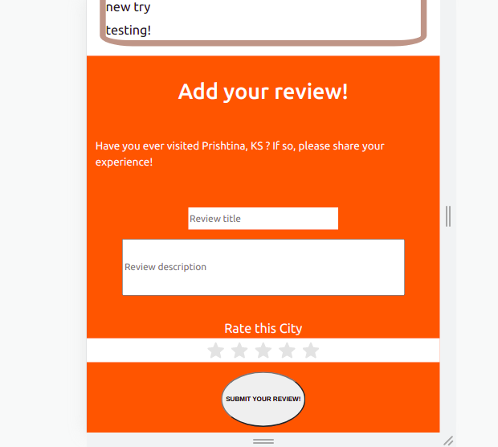

# City Reviewer Front-end

City Reviewer is a full stack application which allows it's users to login using google auth and than view and give reivews to ballkan capitals

## Live server
<button> <a href="https://eloquent-fermi-4c4dc7.netlify.app/"> Live link! </a> </button>

## Built With 

- Javacript
- React
- Redux
- NPM

## Install 

> In order to install this project please follow the next steps:

1. - [ ] Open the `Terminal`
2. - [ ] Navigate to the directory where you want to add this repository
3. - [ ] Run git clone and `git@github.com:GzimAsani/city_reviewer_frontend.git` or with HTTP`https://github.com/GzimAsani/city_reviewer_frontend.git` 
5. - [ ] `cd` in the clonet repo and run `npm install`
6. - [ ] run `npm start` to start the project

> In order to see the testing of this project please follow the following steps:
1. - [ ] Install jest using `npm install --save-dev jest` 
2. - [ ] run `npm test`

## Author

👤 **Gzim Asani**
- Github: [@GzimAsani](https://github.com/GzimAsani)
- Linkedin: [GzimAsani](https://www.linkedin.com/in/gzim-asani-83390a17a/)

## 🤝 Contributing

Contributions, issues and feature requests are welcome!

Feel free to check the [issues page](https://github.com/GzimAsani/city_reviewer_frontend/issues).

## Show your support

Give a ⭐️ if you like this project!